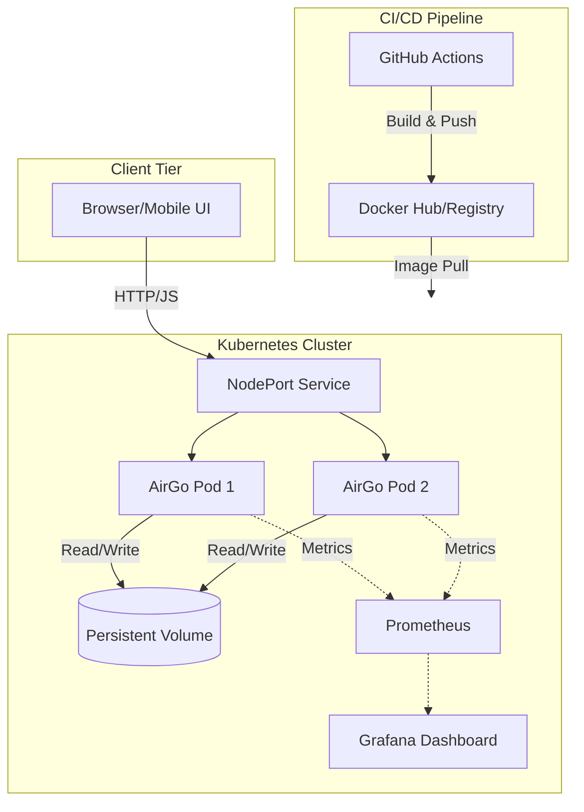

<div align="center">
  

  # 🚀 AirGo: Midnight Edition
  
  **High-Performance, Secure, & Orchestrated LAN File Sharing**

  AirGo is a lightweight, futuristic file-sharing platform designed specifically for Local Area Networks (LAN). Built from the ground up to combine **extreme backend performance** with a **premium, glassmorphic user experience**.

  [](https://go.dev/)
  [](https://alpinejs.dev/)
  [](https://tailwindcss.com/)
  <br>
  [](https://www.docker.com/)
  [](https://kubernetes.io/)
  [](https://grafana.com/)
  [](https://github.com/features/actions)
  [](LICENSE)

  <br>
  <i>Lightning fast uploads. Zero cloud dependencies. Complete data sovereignty.</i>
  <br><br>
</div>

---

## ✦ Table of Contents
- [✨ Key Features](#-key-features)
- [🏗 Architecture & DevOps](#-architecture--devops)
- [🚀 Quick Start & Workflows](#-quick-start--workflows)
  - [1. Developer Workflow (Docker)](#1-the-developer-workflow-local-docker)
  - [2. Administrator Workflow (Kubernetes)](#2-the-administrator-workflow-kubernetes--monitoring)
- [📱 LAN Access (Mobile)](#-lan-access-mobile)
- [📂 Project Structure](#-project-structure)
- [⚙️ Configuration](#️-configuration)
- [🔒 Security Constraints](#-security-constraints)

---

## ✨ Key Features

| Feature | Description |
| :--- | :--- |
| **⚡ Blazing Fast Engine** | Powered by Go's high-concurrency model for saturated link-speed transfers. |
| **🌌 Midnight Luxury UI** | Breathtaking glassmorphism design, dark mode aesthetics, driven by Tailwind CSS and Alpine.js. |
| **🎯 Zero-Friction UX** | Seamless Drag & Drop zones with highly responsive live-progress feedback. |
| **☸️ Orchestration Ready** | Ships with hardened Kubernetes (K8s) manifests for instant horizontal scaling. |
| **📊 Advanced Monitoring** | Native Prometheus and Grafana integration via Helm dashboards. |
| **🤖 CI/CD Automation** | Fully automated GitHub Actions pipeline (Lint, Build, Test, Docker Build, K8s Deploy). |

---

## 🏗 Architecture & DevOps

AirGo employs a modern, robust pipeline from code commit to cluster deployment. 



---

## 🚀 Quick Start & Workflows

AirGo supports two **separate, alternative** workflows depending on your operational requirements. You should employ *either* the Docker workflow *or* the Kubernetes workflow, but not both simultaneously.

### 1. The Developer Workflow (Local Docker)
*Optimum for rapid iteration, testing, and isolated local file sharing.*

```bash
# 1. Clone the intelligence
git clone git@github.com:expertoclock/airgo.git && cd airgo

# 2. Build and Detach the Container
make up

# 3. Access Local Interface
# Nav to: http://localhost:8081

# 4. Graceful Teardown
make down
```

### 2. The Administrator Workflow (Kubernetes & Monitoring)
*The production-grade path for distributed systems, high availability, and telemetry.*

```bash
# 1. Spin up Minikube & Apply Manifests
make k8s-deploy

# 2. Extract Cluster URL
make k8s-url

# 3. View Live Cluster States
make k8s-status

# 4. Inject Telemetry & Access Grafana
make k8s-grafana

# 5. Purge the Cluster Deployment
make k8s-down
```

---

## 📱 LAN Access (Mobile)

AirGo is designed to frictionlessly bridge your desktop and mobile environments.

1. Ensure your host and mobile device occupy the same subnet.
2. The UI will automatically generate an embedded **QR Code** mapping to your `hostname -I`.
3. Simply scan the code or navigate manually to `http://<IP_ADDRESS>:8081`.

> **Firewall Exception:** If connection times out, explicitly allow inbound traffic:
> `sudo ufw allow 8081/tcp`

---

## 📂 Project Structure

A clean, modular structure ensures predictable maintenance.

```text
airgo/
├── .github/workflows/   # CI/CD Pipeline Definitions (build, test, deploy)
├── k8s/                 # Kubernetes Manifests (Deployment, Service)
├── templates/           # Frontend Engine (HTML, injected JS/CSS)
├── uploads/             # Mounted Volume Target for File Persistence
├── main.go              # Go Backend Entry Point & Routers
├── Dockerfile           # Multi-stage, distroless-inspired Image Build
├── compose.yml          # Local Orchestration & Resource mapping
├── Makefile             # Global Automation Macros
└── go.mod               # Dependency Graph
```

---

## ⚙️ Configuration

Environment variables drive the operational behavior (via `.env` or injected secrets):

| Parameter | Type | Default | Impact |
| :--- | :---: | :---: | :--- |
| `PORT` | `int` | `8080` | Internal boundary port the Go binary binds to. |
| `MAX_UPLOAD_SIZE_MB` | `int` | `500` | Hard cap on memory buffering per inbound stream. |
| `GIN_MODE` | `string`| `release` | Toggles Web Framework verbosity (`debug` vs `release`). |

---

## 🛠 Complete Automation Suite (Makefile)

<details>
<summary><b>Click to expand available Make macros</b></summary>

| Macro | Operational Effect |
| :--- | :--- |
| `make build` | Compiles the native Go binary. |
| `make test` | Executes the standard Go testing suite locally. |
| `make test-docker` | Executes unit tests isolated within an Alpine container. |
| `make security` | Invokes AquaSec Trivy to scan the image for vulnerabilities. |
| `make clean` | Purges compiled artifacts and truncates the `uploads/` directory. |
| `make prune` | Eliminates orphaned Docker build cache layers. |

</details>

---

## 🔒 Security Constraints

Security is woven into the deployment architecture:
- **Least Privilege Execution:** The production container abandons root privileges, operating entirely under `appuser` (UID 1000).
- **Graceful Termination:** Catching `SIGTERM` ensures in-flight I/O operations safely conclude to avoid corruption.
- **Resource Clamping:** Both Docker Compose and K8s manifests enforce CPU/Memory ceilings to nullify out-of-memory DoS vectors.
- **Continuous Validation:** Static analysis (`go vet`) and test gating inherently reject compromised pushes during the CI pipeline.

---

<div align="center">
  <p>Distributed under the <strong>MIT License</strong>. For more information, please examine the <code>LICENSE</code> construct.</p>
  <i>Architected for learning, engineered for speed.</i>
</div>
